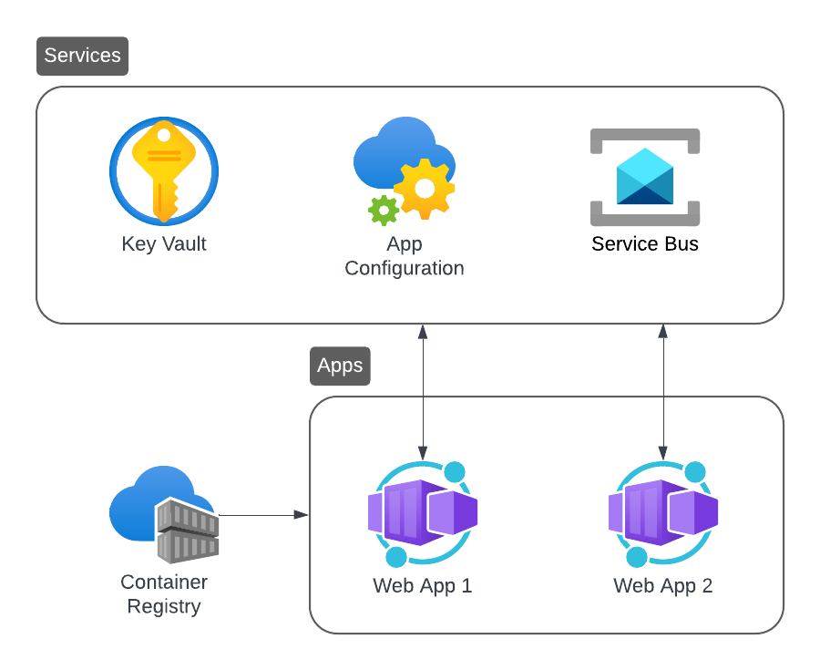

# Aspire Basic Template (Key Vault + App Config + Service Bus/RabbitMQ)
This repository contains an `azd` template that uses **Aspire** as the application orchestrator. The template includes:
- Azure Key Vault for app secrets
- Azure App Configuration for app settings
- Azure Service Bus or RabbitMQ for messaging
- two sample ASP.NET applications that use the above services

## 🏢 Architecture
The architecture of the template is depicted below:



The template supports both **local** and **hybrid** development mode (see below for details).

To enable this, messaging between apps is abstracted using [Rebus](https://github.com/rebus-org/Rebus) 🚌.

The `bicep` template used to provision the Azure resources takes the following parameters:
- `environmentName`: corresponds to `AZURE_ENV_NAME` and is set by `azd` during environment creation
- `location`: corresponds to `AZURE_LOCATION` and is set by `azd` interactively during provisioning
- `hybridEnvironment`: corresponds to `HYBRID_ENVIRONMENT` and must be set manually (can be either `true` or `false`, the default)
- `principalId`: corresponds to `AZURE_PRINCIPAL_ID` and is set by `azd` automatically during provisioning

The principal specified above will be given appropriate permissions to access the provisioned resources, e.g. create secrets in the key vault.

## 🏠 Local Development
In this mode no resources are provisioned and all apps and services run locally:
- app secrets are stored in the project's user secrets
- app settings are stored in the project's `appsettings.Development.json`
- a RabbitMQ container, which includes the management portal, is used for messaging between the apps

Create the secrets using the following `dotnet` commands:
```
dotnet user-secrets -p .\src\AzdAspire.WebApplication1\AzdAspire.WebApplication1.csproj set "WebApp1:AppKey" "MyAppKey1"

dotnet user-secrets -p .\src\AzdAspire.WebApplication2\AzdAspire.WebApplication2.csproj set "WebApp2:AppKey" "MyAppKey2"
```

Since no resources need to be provisioned, there are no other pre-requisites to use local development:
- to run the application in Visual Studio, select the **Development** profile and hit F5
- in VS Code, use: `dotnet run --project .\src\AzdAspire.AppHost\AzdAspire.AppHost.csproj --launch-profile Development`

## 💻 Hybrid Development
In this mode only a few service resources are provisioned and all apps run locally:
- app secrets are stored in Azure Key Vault
- app settings are stored in Azure App Configuration
- Azure Service Bus is used for messaging between the apps

Hybrid development is enabled as follows:
- create a new `azd` environment using the command `azd env new <environment>`, where `<environment>` is your chosen environment name
- locate the newly created file `.azure\<environment>\.env` and append the line `HYBRID_ENVIRONMENT="true"`
- create the service resources by running `azd provision` (you can use the `--preview` flag to preview the changes without creating any resources)
- locate the `Production` profile in the `launchSettings.json`of the Aspire host project
- in the above profile, set the `DOTNET_ENVIRONMENT` variable to `<environment>`
- to run the application in Visual Studio, select the **Production** profile and hit F5
- in VS Code, use: `dotnet run --project .\src\AzdAspire.AppHost\AzdAspire.AppHost.csproj --launch-profile Production`

To prove connectivity to Azure Key Vault, the `WebApp1:AppKey` and `WebApp2:AppKey` secrets are used.

Similarly, for Azure App Configuration, the `WebApp1:AppName` and `WebApp2:AppName` settings are used.

You can create these using the portal or the following `az` commands:
```
az keyvault secret set `
    --vault-name <keyvault> `
    --name WebApp1--AppKey `
    --value MyAppKey1 `
    --output none

az keyvault secret set `
    --vault-name <keyvault> `
    --name WebApp2--AppKey `
    --value MyAppKey2 `
    --output none
```
```
az appconfig kv set `
    --name <appconfig> `
    --key WebApp1:AppName `
    --value MyWebApp1 `
    --yes `
    --output none

az appconfig kv set `
    --name <appconfig> `
    --key WebApp2:AppName `
    --value MyWebApp2 `
    --yes `
    --output none
```

## ☁️ Running in Azure
In this mode all the required resources are provisioned and all apps and services run in the cloud.

To create a fully provisioned runtime environment, follow these steps:
1. download the template with `azd init -t fabio-marini/azd-aspire-basic -b master`
2. login to Azure with `azd auth login`
3. create the service resources by running `azd provision`
4. deploy the applications by running `azd deploy`
5. create the necessary secrets and settings as described in the previous section

## ⚙️ GitHub Actions Workflows

Two workflows are provided in `.github/workflows/`:

### CI Pipeline (`aspire-shell-ci.yml`)
Triggered on **push** or **pull request** to `main` or `develop`.

Steps:
1. Restore dependencies
2. Build in `Release` configuration
3. Run tests with XPlat Code Coverage
4. Upload test results as a GitHub artifact (retained 7 days)
5. Generate an HTML + Cobertura coverage report via [ReportGenerator](https://github.com/danielpalme/ReportGenerator)
6. Upload the coverage report as a GitHub artifact (retained 7 days)

### CD Pipeline (`aspire-shell-cd.yml`)
Triggered **manually** via `workflow_dispatch`. Requires an `azure-env-name` input at run time.

Steps:
1. Install `azd`
2. Authenticate to Azure using **OIDC federated credentials** (no stored client secret)
3. `azd provision` — create/update all Azure resources
4. `azd deploy` — build and deploy the application containers

The following **repository variables** must be configured before running the CD pipeline:

| Variable | Description |
|---|---|
| `AZURE_CLIENT_ID` | Client ID of the app registration used for OIDC login |
| `AZURE_TENANT_ID` | Azure AD tenant ID |
| `AZURE_SUBSCRIPTION_ID` | Target subscription ID |
| `AZURE_LOCATION` | Azure region (e.g. `eastus`) |

> Run `azd pipeline config -e <environment>` to create the app registration and configure federated credentials automatically.

## 🧪 Testing the Solution
To test that everything is wired up correctly, use the `POST /echo` endpoint of **WebApp1**, e.g.
```
Invoke-WebRequest -Uri https://localhost:7099/echo `
  -Method POST `
  -Headers @{ "Content-Type" = "application/json" } `
  -Body '{ "message": "Hello World! :)" }'
```

Take a look at the logs for **WebApp2** to confirm connectivity to the message bus. They should show that an `EchoRequest` was received:
```
Received AzdAspire.ServiceDefaults.EchoRequest with message: Hello World! :) and headers [x-appkey, LocalKey1], [x-appname, LocalApp1]
```

And the logs for **WebApp1** should show that an `EchoResponse` was received:
```
Received AzdAspire.ServiceDefaults.EchoResponse with message: Hello World! :) and headers [x-appkey, LocalKey2], [x-appname, LocalApp2]
```

The messages headers will contain the values of the `AppName` and `AppKey` settings and will confirm the connectivity to Key Vault and App config (for hybrid environments).

## ✏️ Renaming the Projects

A Copilot prompt is provided at `.github/prompts/rename-projects.prompt.md` to help rename all projects in the solution from the default `AzdAspire` prefix to a custom one.

To use it, open the prompt in VS Code (with the GitHub Copilot extension) and supply the `{new-prefix}` value. The prompt instructs Copilot to:

1. Rename all project files and folders under `src/` using `git mv`
2. Replace all occurrences of `AzdAspire` in:
   - `.github/copilot-instructions.md`
   - `.github/workflows/aspire-shell-cd.yml`
   - `.github/workflows/aspire-shell-ci.yml`
   - `azure.yaml`
   - `README.md`
   - `AGENTS.md`
3. Run `dotnet build` to verify the solution still compiles
